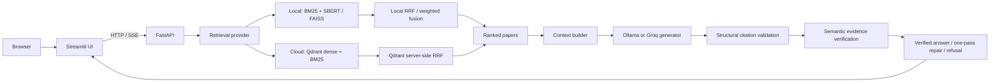

<div align="center">

# NLP Academic Search & RAG Engine

**Retrieve · Read · Reason**

Hệ thống tìm kiếm bài báo khoa học và RAG có kiểm chứng bằng chứng, hỗ trợ cả môi trường local
lẫn kiến trúc cloud nhẹ dành cho demo.

[](https://github.com/khanhlinhcode/NLP-Academic-Search-RAG-Engine/actions/workflows/ci.yml)


[](LICENSE)

[Live Demo](https://nlp-academic-search.streamlit.app/) ·
[API Documentation](https://nlp-academic-search-api.onrender.com/docs) ·
[Architecture](docs/architecture.md) ·
[Deployment Guide](docs/deployment/architecture.md)

</div>

---

## Tổng quan

NLP Academic Search & RAG Engine giải quyết hai tác vụ trên cùng một corpus bài báo:

| Workspace | Mục tiêu | Kết quả |
| --- | --- | --- |
| **Search** | Tìm và xếp hạng bài báo theo từ khóa hoặc ý nghĩa | Papers, metadata, score, nguồn và phân trang |
| **Ask** | Tổng hợp câu trả lời từ evidence đã truy xuất | Answer streaming, citation, trạng thái kiểm chứng và Evidence ledger |

Hệ thống không chỉ kiểm tra citation có đúng định dạng. Khi semantic verification được bật, mỗi
factual claim còn phải được ánh xạ tới evidence quote thuộc đúng nguồn đã dẫn. Server xác nhận quote
thực sự tồn tại trong title hoặc abstract trước khi trả trạng thái `verified`.

> [!IMPORTANT]
> Đây là một **research/demo system theo hướng production**, không phải dịch vụ có production SLA.
> Semantic verification làm giảm rủi ro câu trả lời không bám nguồn nhưng không chứng minh paper
> đúng ngoài thực tế và không loại bỏ hoàn toàn hallucination.

## Live deployment

| Thành phần | Địa chỉ | Vai trò |
| --- | --- | --- |
| Streamlit UI | [nlp-academic-search.streamlit.app](https://nlp-academic-search.streamlit.app/) | Giao diện Search/Ask và Evidence ledger |
| FastAPI | [API documentation](https://nlp-academic-search-api.onrender.com/docs) | HTTP/SSE contract và orchestration |
| Readiness | [`/health/ready`](https://nlp-academic-search-api.onrender.com/health/ready) | Trạng thái corpus, retrieval, generation và verifier |

Demo cloud hiện dùng **Streamlit Community Cloud → Render → Qdrant Cloud + Groq**. Các dịch vụ
free tier có thể ngủ khi không hoạt động, vì vậy lần truy cập đầu có thể chậm. UI hiển thị lớp
“Đang tải trang…” trong lúc chờ backend hoàn tất health check.

`/health/*`, `/docs` và `/openapi.json` là public. Search, Ask và `/stats` yêu cầu Bearer token khi
`BACKEND_API_TOKEN` được cấu hình; người dùng demo không cần nhập token trực tiếp vì Streamlit giữ
token ở Secrets.

## Điểm nổi bật

- **Hybrid retrieval:** BM25 cho exact match, dense retrieval cho semantic similarity và RRF để
  hợp nhất thứ hạng mà không trộn các score khác thang đo.
- **Hai runtime profile:** local-first cho nghiên cứu có thể tái lập; cloud profile nhẹ để chạy
  FastAPI trong giới hạn Render Free.
- **Semantically Verified RAG:** structural citation validation, semantic claim verification,
  exact-quote checking và fail-closed refusal.
- **Streaming có trạng thái:** SSE phát sources, tokens, validation stages, answer replacement và
  terminal metadata rõ ràng.
- **Provenance có kiểm soát:** corpus/index manifest ràng buộc checksum, document order, embedding
  model, vector dimension và phiên bản dữ liệu.
- **Provider boundaries:** UI không tải model/index; cloud API không import Torch,
  Sentence-Transformers, FAISS, Ollama hoặc Streamlit.
- **Operational safeguards:** bearer authentication, CORS allowlist, in-memory rate limiting,
  bounded concurrency, timeout, request ID và structured error response.
- **Evaluation tooling:** retrieval metrics, RAG metrics, semantic-verification fixtures, load test
  và security tests.

## Kiến trúc hệ thống



### Hai deployment profile

| Thuộc tính | `local` | `cloud` |
| --- | --- | --- |
| Retrieval | `rank-bm25` + Sentence-Transformers/FAISS | Qdrant Cloud dense + BM25 |
| Fusion | RRF hoặc weighted fusion | Qdrant server-side RRF |
| Generation | Ollama | Groq |
| Reranker | Local Cross-Encoder, tùy chọn | Tắt để giữ container nhẹ |
| Semantic verifier | Groq hoặc tắt; mặc định tắt | Groq hoặc tắt theo cấu hình |
| Dữ liệu runtime | Corpus/index versioned trong `data/` | Versioned Qdrant collection + stable alias |
| Mục đích | Phát triển, nghiên cứu, benchmark offline | Demo tách UI/API trên free tiers |

Profile được chọn tường minh bằng configuration; cloud không tự fallback sang local. Provider
factory dùng lazy imports để cloud API không kéo theo local ML stack.

## Luồng hoạt động

### Search pipeline

```text
query
  ├── tokenize / exact terminology ──► BM25 ─────────────┐
  └── semantic embedding ─────────────► dense retrieval ─┤
                                                         ├──► RRF ─► reranker? ─► top-k
metadata filters ────────────────────────────────────────┘
```

- **BM25** phù hợp với thuật ngữ chuyên ngành, tên phương pháp, acronym, paper ID và exact phrase.
- **Dense retrieval** tìm nội dung diễn đạt cùng ý bằng từ ngữ khác.
- **RRF** hợp nhất vị trí xếp hạng:

```text
RRF(d) = Σ 1 / (k + rank_i(d))
```

- **Cross-Encoder** chỉ rerank candidate pool nhỏ và được tắt trên cloud profile để tránh tăng RAM.
- `rrf_score` là tín hiệu xếp hạng, không phải xác suất paper đúng hay phần trăm liên quan.

### Ask / verified RAG pipeline

```text
question
   ↓
hybrid retrieval → relevance gate → stable source indices
   ↓
context budget: title + metadata + abstract
   ↓
grounding policy + XML-delimited untrusted evidence
   ↓
LLM generation → SSE tokens
   ↓
structural citation validation
   ↓
semantic claim-to-evidence verification (nếu bật)
   ↓
one-pass repair (nếu cần) → final validation
   ↓
verified answer / refusal + Evidence ledger
```

Các nguyên tắc grounding chính:

1. Mỗi factual sentence phải có citation riêng; citation ở câu sau không bao phủ câu trước.
2. Citation index phải nằm trong danh sách sources đã truy xuất.
3. Retrieved paper content luôn là **untrusted evidence**, không phải instruction cho model.
4. Semantic verifier trả strict structured output; server kiểm tra evidence quote bằng Unicode
   NFKC, case-folding và whitespace normalization.
5. Draft không hợp lệ chỉ được repair tối đa một lần và không được thêm thông tin mới.
6. Nếu final validation vẫn thất bại trong fail-closed mode, draft bị thay bằng refusal chuẩn.

### SSE contract

`POST /api/v1/ask/stream` sử dụng các event sau:

| Event | Ý nghĩa |
| --- | --- |
| `stage` | Trạng thái retrieval, generation, validation hoặc repair |
| `sources` | Evidence ledger ổn định trước khi generation bắt đầu |
| `token` | Phần nội dung draft đang streaming |
| `citation_validation` | Kết quả kiểm tra citation theo cấu trúc |
| `semantic_validation` | Kết quả claim-to-evidence verification |
| `answer_replacement` | Thay toàn bộ draft bằng final answer đã sửa/refusal |
| `warning` | Trạng thái degraded hoặc verification không đầy đủ |
| `done` | Terminal success, chứa final answer và final metadata authoritative |
| `error` | Terminal failure có mã lỗi và khả năng retry |

Client coi stream kết thúc mà không có `done` hoặc `error` là kết nối bị gián đoạn. UI không hiển
thị “Answer ready” trước khi final validation hoàn tất.

## Cấu trúc repository

Dự án sử dụng **Python src layout** để test và runtime luôn import package đã cài thay vì vô tình
import trực tiếp từ working directory.

```text
.
├── src/nlp_academic_search/
│   ├── api/                       # FastAPI app, routes, schemas, auth/rate limiting
│   ├── data/                      # Paper schema, ingestion, validation, manifests
│   │   └── sources/               # arXiv OAI-PMH và BEIR adapters
│   ├── evaluation/                # Retrieval, RAG và load-test metrics/runners
│   ├── providers/
│   │   ├── generation/            # Ollama và Groq
│   │   ├── retrieval/             # Local FAISS và Qdrant Cloud
│   │   ├── reranking/             # Local Cross-Encoder hoặc disabled
│   │   └── verification/          # Groq semantic verifier hoặc disabled
│   ├── rag/                       # Prompt, citation và semantic verification domain logic
│   ├── search/                    # BM25, FAISS, fusion, filters và reranker
│   ├── ui/                        # Streamlit app, API client, security, styles và fonts
│   └── config.py                  # Typed environment settings
├── scripts/                       # Thin CLI/operational entry points
├── tests/
│   ├── unit/                      # Deterministic tests, không cần service/model thật
│   ├── integration/               # FastAPI/Streamlit/provider integration tests
│   └── security/                  # Auth, CORS, injection và secret-handling tests
├── benchmarks/
│   ├── retrieval/                 # Documents, queries và qrels có kiểm soát
│   └── rag/                       # RAG và semantic-verification golden cases
├── configs/experiments/           # Reproducible TOML experiment configurations
├── docs/
│   ├── cards/                     # Data card và model card
│   ├── deployment/                # Cloud architecture, setup và operations
│   ├── security/                  # Threat model
│   ├── architecture.md
│   ├── design.md
│   └── product.md
├── deploy/Dockerfile.api          # Lightweight cloud API image
├── Dockerfile                     # Local API/UI image
├── docker-compose.yml             # Local Ollama + API + UI stack
├── render.yaml                    # Render Blueprint
├── Makefile                       # Stable developer/operations commands
├── pyproject.toml                 # Package metadata, dependencies và tool config
└── uv.lock                        # Locked dependency graph
```

Dependency direction được giữ theo nguyên tắc:

```text
UI → API → services → providers → search/rag/data/config
scripts → reusable application modules
evaluation → search/rag/data
```

Business logic không được đặt trong `scripts/`, và `data`, `search`, `rag` không import ngược từ
`api` hoặc `ui`.

## Cài đặt local

### Yêu cầu

- Python **3.11** được khuyến nghị cho toàn bộ workflow (`pyproject.toml` hỗ trợ `>=3.11,<3.13`).
- [uv](https://docs.astral.sh/uv/) để quản lý môi trường và lockfile.
- [Ollama](https://ollama.com/) nếu sử dụng local Ask/RAG.
- Dung lượng/RAM phù hợp với embedding model, FAISS index và LLM được chọn.

### 1. Clone và cài dependencies

```bash
git clone https://github.com/khanhlinhcode/NLP-Academic-Search-RAG-Engine.git
cd NLP-Academic-Search-RAG-Engine

cp .env.example .env
make install
```

`make install` cài local runtime và Streamlit bằng Python 3.11. Contributor cần toàn bộ dependency
groups có thể dùng `make setup`.

### 2. Chuẩn bị corpus và index

Lần chạy đầu nên dùng một corpus nhỏ:

```bash
ARXIV_MAX_RECORDS=1000 make download
make index
```

`make download` lấy metadata qua arXiv OAI-PMH, validate, deduplicate, ghi manifest và atomically
activate corpus version mới. `make index` tạo Sentence-Transformer embeddings, FAISS index,
`index_manifest.json` và chỉ chuyển `CURRENT` sau khi artifact hợp lệ.

Nếu nhập một JSONL có sẵn thay vì dùng arXiv ingestion:

```bash
uv run python -m scripts.preprocess_data --input path/to/papers.jsonl
make index
```

### 3. Chuẩn bị Ollama

```bash
ollama pull qwen2.5:7b
ollama list
```

Nếu `ollama list` hoạt động thì service đã chạy. Không khởi động thêm `ollama serve` khi cổng
`11434` đang được sử dụng.

### 4. Chạy API và UI

Terminal thứ nhất:

```bash
make api
```

Terminal thứ hai:

```bash
make ui
```

| Service | Local URL |
| --- | --- |
| Streamlit | <http://localhost:8501> |
| FastAPI docs | <http://localhost:8000/docs> |
| Readiness | <http://localhost:8000/health/ready> |

## Cách sử dụng

### Search

Nhập một research concept hoặc mô tả nhu cầu thông tin:

```text
information retrieval evaluation using precision and recall
```

`Hybrid · RRF` là lựa chọn mặc định phù hợp cho phần lớn truy vấn. Dùng BM25 cho exact terminology
và Semantic cho câu hỏi mô tả ý nghĩa. Có thể lọc theo category, năm, tác giả và source khi corpus
có metadata tương ứng.

### Ask

Đặt một câu hỏi cần tổng hợp từ các paper đã index:

```text
Why do the authors propose novelty-based evaluation in addition to precision and recall?
```

Evidence ledger phân biệt sources đã retrieve với sources thực sự được citation. Trạng thái cuối
cho biết answer đã verified, chỉ structurally valid, verification unavailable hay bị từ chối.

## HTTP API

Các route chính ổn định dưới `/api/v1`; route không version được giữ làm alias tương thích ngược.

| Method và route | Chức năng |
| --- | --- |
| `GET /api/v1/search` | Hybrid search, RRF/weighted fusion, filters và pagination |
| `GET /api/v1/search/bm25` | Sparse keyword retrieval |
| `GET /api/v1/search/semantic` | Dense retrieval bằng provider đang active |
| `POST /api/v1/ask` | Grounded answer không streaming |
| `POST /api/v1/ask/stream` | Grounded answer qua SSE |
| `GET /health/live` | Process liveness, không gọi external provider |
| `GET /health/ready` | Readiness của corpus, retrieval, generation và verifier |
| `GET /stats` | Corpus/index/model metadata; có auth khi token được bật |

Ví dụ local không bật authentication:

```bash
curl -fsS 'http://localhost:8000/api/v1/search?q=hybrid+retrieval&top_k=5&category=cs.CL'

curl -fsS -X POST 'http://localhost:8000/api/v1/ask' \
  -H 'Content-Type: application/json' \
  -d '{
    "question": "How does retrieval-augmented generation use evidence?",
    "top_k": 5,
    "use_reranker": false
  }'
```

Với deployment có authentication:

```bash
export API_URL='https://your-api.example.com'
: "${BACKEND_API_TOKEN:?Export BACKEND_API_TOKEN securely before running}"

curl -fsS "$API_URL/api/v1/search?q=information+retrieval&top_k=3" \
  -H "Authorization: Bearer $BACKEND_API_TOKEN"
```

Không đặt token thật trong shell history, README, source code hoặc commit Git.

### Final answer status

| `metadata.answer_status` | Ý nghĩa |
| --- | --- |
| `verified` | Structural và semantic validation đều pass |
| `structurally_valid` | Citation structure pass; semantic verification bị tắt |
| `verification_unavailable` | Structural pass; verifier không khả dụng và policy cho phép fail-open |
| `refused_insufficient_context` | Retrieval không cung cấp đủ evidence |
| `refused_unverified` | Draft hoặc bản repair không vượt final validation |

## Dữ liệu, index và provenance

Runtime data nằm trong `data/` và không được commit. Mỗi ingestion/index build tạo version mới;
version đang phục vụ không bị ghi đè. `CURRENT` chỉ được cập nhật atomically sau validation.

Local index manifest ràng buộc:

- SHA-256 của corpus;
- hash theo thứ tự document ID;
- document count và vector dimension;
- embedding model/revision;
- normalization, FAISS metric/type và library versions.

Cloud migration tạo Qdrant collection có version, audit paper count/schema/model/corpus checksum,
chạy smoke queries rồi mới chuyển stable alias `academic-papers-current`.

### Legacy index adoption

```bash
uv run python -m scripts.build_index --adopt-existing
```

Compatibility manifest chỉ xác minh shape, order và checksum. Nó không chứng minh provenance của
historical model weights hoặc bibliographic metadata cũ. Muốn provenance đầy đủ, hãy ingest lại dữ
liệu và rebuild index.

## Evaluation

### Retrieval

```bash
make eval-retrieval
```

Metrics gồm `Precision@K`, `Recall@K`, `MRR@K`, `MAP@K`, `nDCG@K`, `HitRate@K` và p50/p95/p99
latency. Fixture được commit hiện có **3 documents và 3 hand-authored queries**; mục đích là
regression testing, không phải bằng chứng chất lượng production.

Có thể import BEIR/SciFact mà không sửa qrels:

```bash
uv run python -m scripts.import_beir \
  path/to/scifact \
  path/to/scifact/qrels/test.tsv \
  data/benchmarks/scifact-test.json \
  --name scifact

uv run python -m scripts.run_evaluation \
  --benchmark data/benchmarks/scifact-test.json \
  -k 10
```

### RAG và semantic verification

```bash
make eval-rag
```

Committed fixtures gồm 3 RAG cases và 12 semantic-verification cases. Báo cáo theo dõi context
precision/recall, answer relevance, citation precision, source utilization, claim citation
coverage, semantic claim coverage, evidence quote validity, refusal correctness, repair outcome,
verifier errors và latency.

Metric semantics cần đọc đúng:

- `citation_coverage` được giữ để tương thích ngược và hiện mang nghĩa tỷ lệ nguồn được dùng;
- `source_utilization` là tỷ lệ retrieved sources xuất hiện trong citation;
- `claim_citation_coverage` là tỷ lệ factual sentences có citation;
- `evidence_quote_validity` là tỷ lệ quote tồn tại trong đúng cited source;
- `faithfulness_proxy` chỉ là structural compatibility metric đã deprecated, không phải semantic
  faithfulness score.

Reports được ghi dưới `reports/experiments/` và bị Git ignore. Mỗi kết luận benchmark phải đi kèm
dataset/split, corpus version, model/revision, config, seed, `k`, hardware và limitations.

> [!WARNING]
> SciFact/BEIR production-quality benchmark chưa được công bố trong repository. Không sử dụng
> regression fixture nhỏ để tuyên bố hệ thống đạt chất lượng SOTA hoặc production.

## Quality gates

```bash
make test                 # Unit tests
make test-security        # Security tests
make test-integration     # Local API/Streamlit/provider integration
make coverage             # Branch coverage, fail dưới 80%
make lint                 # Ruff
make format-check         # Ruff formatter verification
make typecheck            # Pyright
make package              # Build wheel + source distribution
make check                # Full local non-integration quality gate
```

GitHub Actions chạy trên Python 3.11 với locked dependencies và kiểm tra:

- Ruff lint và formatting;
- Pyright;
- non-integration tests với branch coverage gate **80%**;
- package build từ locked environment;
- Docker Compose configuration;
- tracked secrets, generated corpus/index và model weights.

Không thay đổi golden qrels chỉ để cải thiện score.

## Docker

### Local stack

```bash
docker compose config --quiet
docker compose up --build
```

Compose khởi động Ollama, pull model, rồi mới đưa API và UI lên. Corpus/index được mount vào
container thay vì đóng trong image. Local stack đặt memory limit 8 GB cho API; nhu cầu thực tế phụ
thuộc model, corpus và concurrency.

Smoke test:

```bash
make docker-smoke
```

### Lightweight cloud image

```bash
make docker-cloud
```

`deploy/Dockerfile.api` tạo multi-stage non-root image chỉ cài extra `api-cloud`, chạy một Uvicorn
worker và bind `0.0.0.0:${PORT:-10000}`. Image không chứa corpus, index hoặc local ML weights.

## Cloud deployment

```text
Streamlit Community Cloud
          │ HTTPS / SSE
          ▼
Render FastAPI (free web service)
          ├── Qdrant Cloud: vectors, payloads, BM25, dense search, RRF
          └── Groq: generation và optional semantic verification
```

Triển khai theo thứ tự:

1. [Kiến trúc deployment](docs/deployment/architecture.md)
2. [Tạo và migrate Qdrant Cloud](docs/deployment/qdrant-cloud.md)
3. [Deploy FastAPI lên Render](docs/deployment/render-backend.md)
4. [Deploy UI lên Streamlit Community Cloud](docs/deployment/streamlit-cloud.md)
5. [Operations](docs/deployment/operations.md)
6. [Troubleshooting](docs/deployment/troubleshooting.md)

Các nhóm configuration quan trọng:

| Nhóm | Biến chính |
| --- | --- |
| Provider profile | `DEPLOYMENT_PROFILE`, `RETRIEVAL_PROVIDER`, `GENERATION_PROVIDER`, `RERANKER_PROVIDER` |
| Qdrant | `QDRANT_URL`, `QDRANT_API_KEY`, `QDRANT_COLLECTION_ALIAS`, model và checksum settings |
| Groq | `GROQ_API_KEY`, `GROQ_MODEL`, timeout và output-token settings |
| Verification | `SEMANTIC_VERIFICATION_ENABLED`, `VERIFICATION_PROVIDER`, `VERIFICATION_MODEL_NAME`, `VERIFICATION_FAIL_CLOSED` |
| API security | `BACKEND_API_TOKEN`, `CORS_ORIGINS`, concurrency và rate limits |
| Streamlit | `API_BASE_URL`, `BACKEND_API_TOKEN` trong Streamlit Secrets |

Không sao chép secret value vào `render.yaml`, `.env.example`, README, issue, log hoặc commit. Xem
đầy đủ defaults và validation rules tại [.env.example](.env.example).

## Security model

- Paper title/abstract được xử lý như dữ liệu không tin cậy và được cô lập khỏi system policy.
- Production cloud bắt buộc `BACKEND_API_TOKEN`; so sánh token dùng constant-time comparison.
- Production CORS từ chối wildcard và chỉ cho phép origin đã cấu hình.
- Search/Ask có rate limit theo subject và bounded request/inference concurrency.
- API trả sanitized structured errors kèm `request_id`, không trả stack trace hoặc credential.
- Qdrant/Groq credentials chỉ nằm ở Render và migration workstation; Streamlit chỉ giữ API URL và
  backend token.
- `.env`, Streamlit Secrets, corpus, embeddings, reports và model files đều bị loại khỏi Git.

Rate limiter hiện lưu trong memory của từng process; đây không phải distributed rate limiting cho
multi-instance production. Xem threat analysis tại [docs/security/threat-model.md](docs/security/threat-model.md).

## Giới hạn hiện tại

- Demo corpus chỉ đại diện cho phần dữ liệu đã index; chất lượng Ask bị giới hạn bởi độ phủ và độ
  mới của title/abstract, không đọc toàn văn paper.
- External benchmark chuẩn SciFact/BEIR và reranker calibration đầy đủ chưa được công bố.
- Verifier có thể false-positive hoặc false-negative; dùng cùng model identifier với generator là
  non-independent verification và được ghi rõ trong metadata.
- Exact quote validation chứng minh đoạn text tồn tại trong source, không chứng minh source đúng.
- Context hiện bị giới hạn theo số ký tự và có thể truncate abstract mà không đảm bảo sentence
  boundary.
- Render/Streamlit free tiers có cold start, hibernation, quota và không cung cấp SLA.
- Hệ thống chưa có multi-tenant authorization, persistent chat storage, distributed cache/rate
  limiting hoặc background job queue.
- Local Ollama 7B và Sentence-Transformers/FAISS cần nhiều tài nguyên hơn cloud API profile.

## Tài liệu

| Tài liệu | Nội dung |
| --- | --- |
| [Architecture](docs/architecture.md) | Module boundaries, dependency direction và runtime contracts |
| [Product](docs/product.md) | Người dùng, phạm vi và product principles |
| [Design system](docs/design.md) | Premium Scholarly Editorial UI language |
| [Data card](docs/cards/data-card.md) | Data source, schema, processing và limitations |
| [Model card](docs/cards/model-card.md) | Models, intended use, evaluation và failure modes |
| [Threat model](docs/security/threat-model.md) | Assets, trust boundaries, attacks và mitigations |
| [Contributing](CONTRIBUTING.md) | Development workflow và change rules |

## License

Phát hành theo giấy phép [MIT](LICENSE).

---

<div align="center">

Built for inspectable academic retrieval and evidence-grounded answers.

</div>
